# HireXApp

HireX is the proposed mobile app's name that brings employees, and startups company on a single platform. This app would address a variety of perceived needs in the startup and hiring process ecosystems. Taking the current system of a company as an example, there would be a problem recruiting someone owing to a lack of cash and other resources. As a result, I was inspired to create HireX, a smartphone app that addresses all of the problems that a startup company faces. By attracting a large number of company and employees to this platform, this app maintain the ecosystem of startup. This app would benefit both employees and startup company by offering a job-ready platform for employees as well as numerous connections to various startup companies in need of employees. 
This app has a lot of features. This system is set up in such a way that different sorts of users can register and log in to this app. The primary user of this app is a startup company, with employees as secondary users. All users should be able to perform just their assigned or authorized tasks. Likewise, 

###### Startups company
- able to register, login and delete their account
- should be able to create, update, read and delete profile
- should be able to post about their jobs raise and also be able to apply crud operation on it.
- should be able to accept or reject job application.
- should be able to delete their account and view all the details of applicants or employee avaliable in app.

###### Employee
-	able to register, login and delete their account
- should be able to create, update, read and delete profile
-	can be able to post about their jobs opening including their skill and also be able to apply crud operation on it.
-	able to apply for the job posted by the company
-	able to see the profile of startup's company and also able to comment and like the post which is posted by employee and investor.

This app is completed using flutter as a frontend and NodeJS as a backend to make android app and RESTAPI respectively. I use this technology to complete my app because flutter is a cross-platform and provides us a facility to build an application for both andriod and ios devices. It has many advantages as compared with native app development paltform some of them are mentioned below:
- Same UI and Business Logic in All Platforms
- Reduced Code Development Time
- Increased Time-to-Market Speed
- Similar to Native App Performance
- Custom, Animated UI of Any Complexity Available
- Own Rendering Engine
- Simple Platform-Specific Logic Implementation

NodeJS is used as a backend language to develop the RESTFUL API because it is scalable, easy, and gives high performance, etc. As a begginer level developer I faced challenges to select architecture, backend language and database to make this application full flaged. After reseraching about this all things I am able to select repository pattern as a flutter architecture, mongoDB as database to store structured as well as unstructure data in a key vlaue pair and NodeJS as a backend as this is highly scalable and easy to make restful api than other platform as compared to django.

## Architecture followed to complete this app 
To complete this app I used repository pattern architecture.The repository pattern is a software design pattern that introduces a centralized component called a repository to separate the data access logic from the business logic.
The repository pattern offers us the following key benefits:

- It gives a way to access data from a centralized location to prevent data-access-related code repetition
- The codebase becomes more unit-testable because the data layer gets decoupled from the business logic
- We can easily switch data sources without doing time-consuming code changes

## ScreenShots

  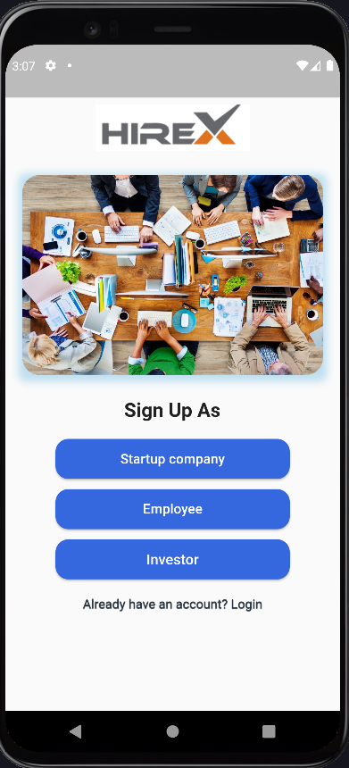
  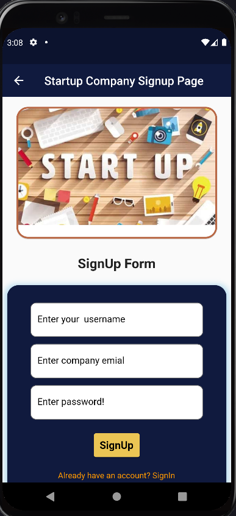
  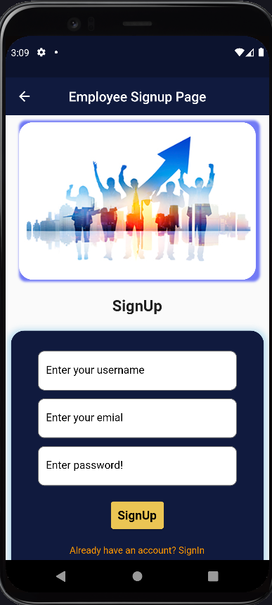
  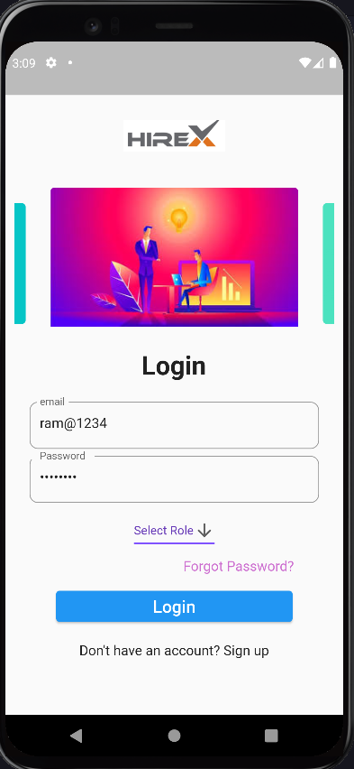
  

  
  ###### company side
  
  

  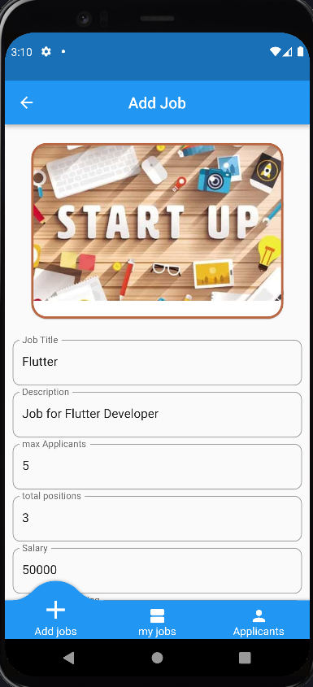
  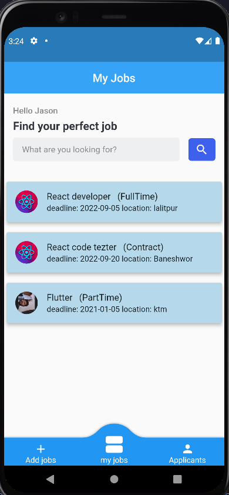
  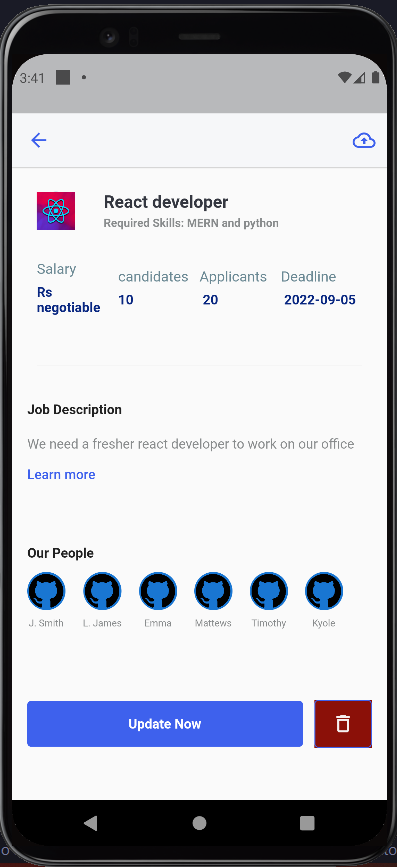
  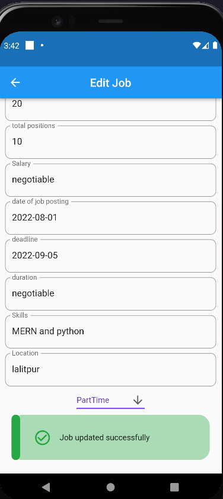
  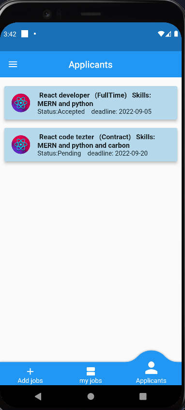
  

  
  ###### Employee side
  

  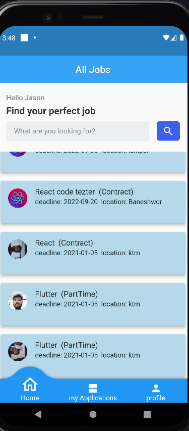
  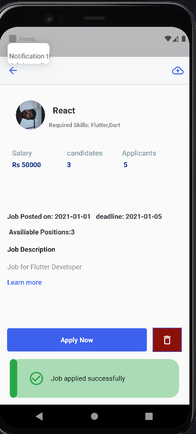
  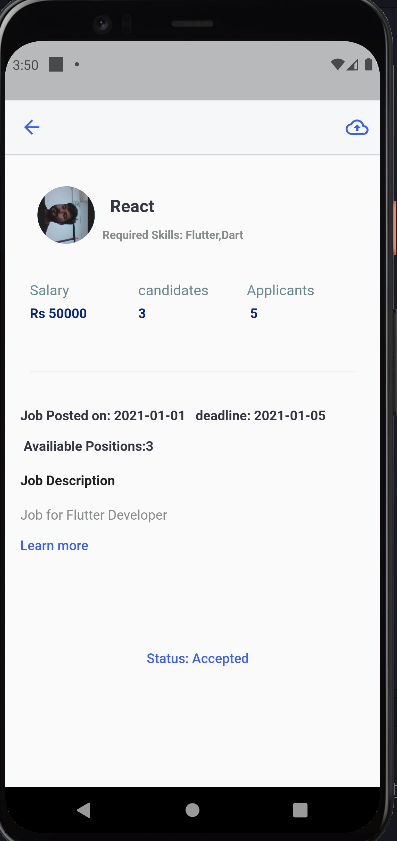
  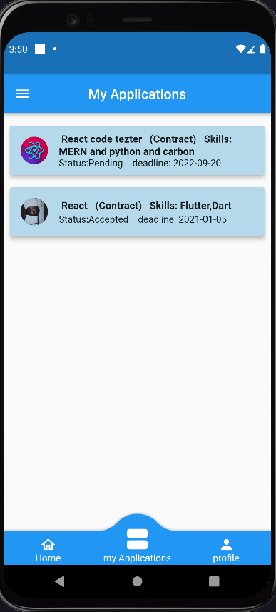
  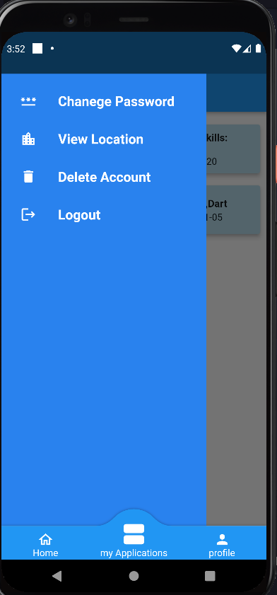
  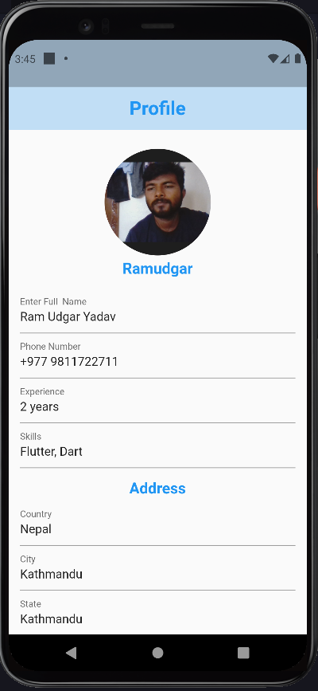
  
  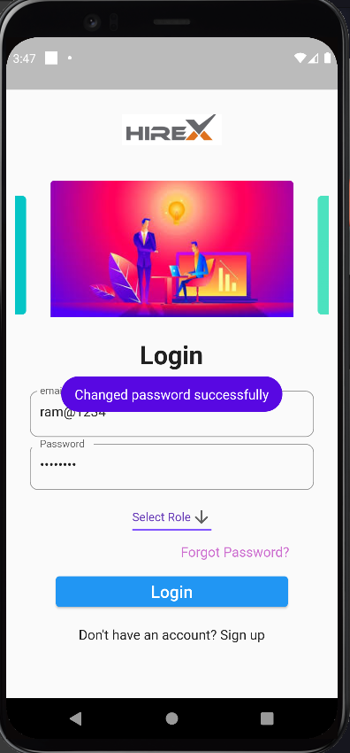
  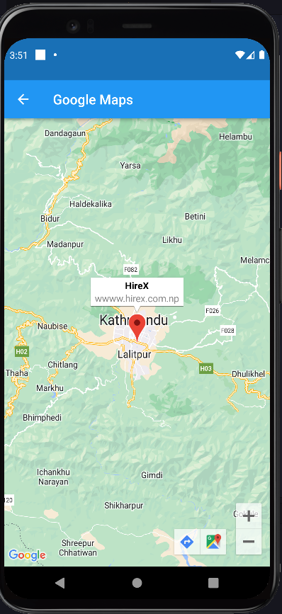
  

  
  ###### Tab view
  
  

  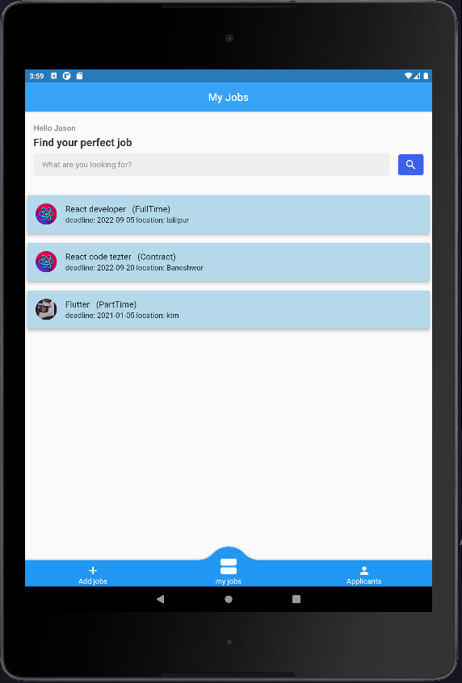
  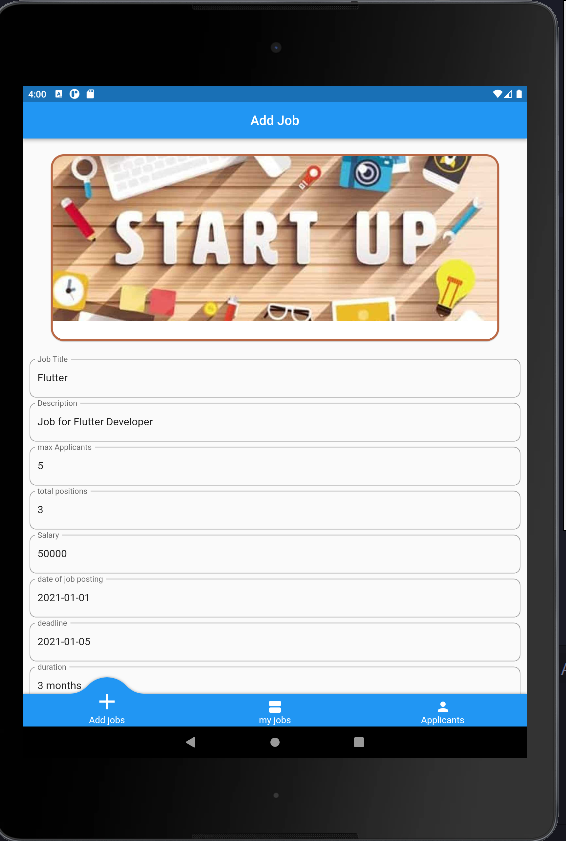
  

  
  ###### WearOS
  

  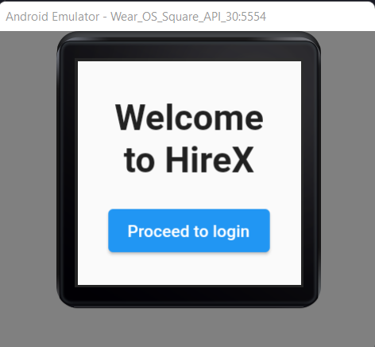
  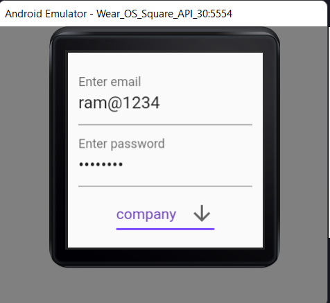
  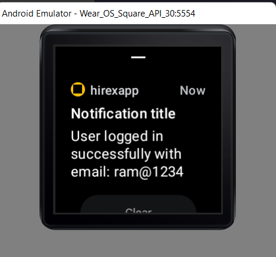
  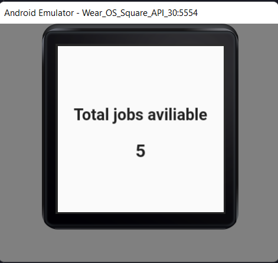

## Conclusion
Finally, this is a mobile app built with the flutter framework and NodeJs for REST API. HireX is the name of this smartphone app that connects the whole startup ecosystem on a single platform. It unites workers and startups into a single community. The purpose of this software is to overcome the communication gap between employees and businesses. This app was built utilizing the flutter repository pattern architecture because this pattern is a software design pattern that creates a centralized component called a repository to isolate the data access logic from the business logic.

